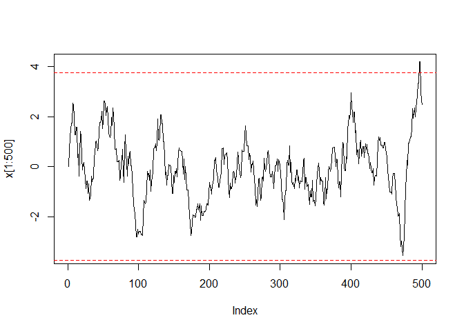
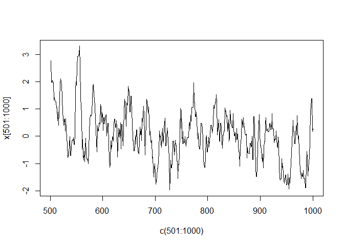
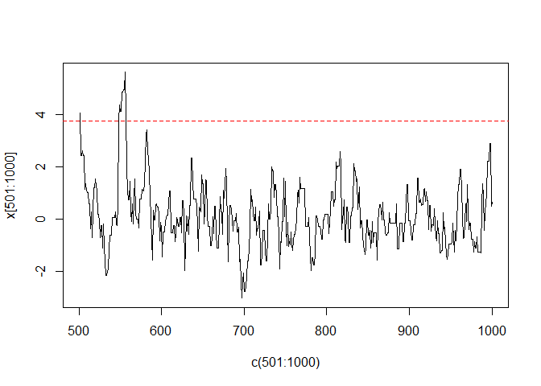
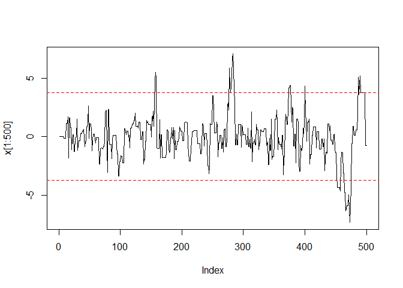
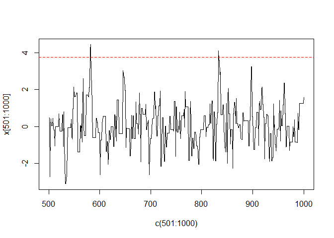
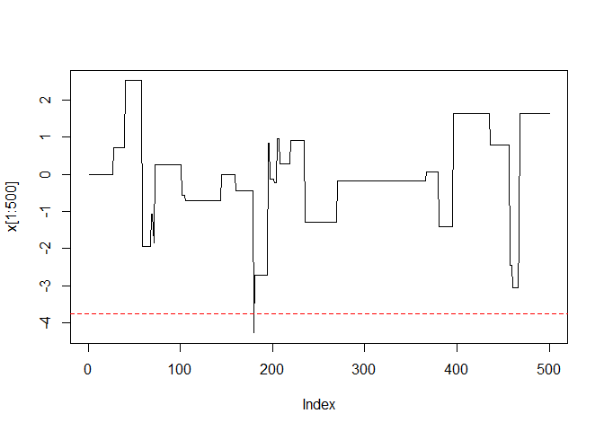

<!-- get the required files from 3rd party sources -->
<link href='http://fonts.googleapis.com/css?family=Roboto' rel='stylesheet' type='text/css'> <!-- use the font -->

```{=html}
<style>
  body {
    font-family: 'Roboto', sans-serif;
  }
</style>
```
\newpage


# Problema:

Pretende-se gerar 2000 números de uma distribuição t de Student com 4 graus de liberdade via um 
passeio aleatório. Considere como distribuição candidata a distribuição normal padrão, assim como, 
a possibilidade de admitir diferentes valores para o seu desvio-padrão, como por exemplo 0.5 e 2.
Considere, para cada uma das situações anteriores, o valor inicial igual a 0.

Implemente o algoritmo em R e compare, para cada uma das situações, a distribuição empírica dos 
valores gerados com a distribuição teórica. Decida por uma distribuição candidata.

Para a distribuição candidata escolhida, avalie diferentes porções da cadeia e deite fora as p primeiras 
observações do passeio aleatório que lhe pareçam que não possuem a distribuição alvo. 

Interprete todos os resultados obtidos.

# Resolução:

Considerando as curvas de distribuição da função alvo e das normais candidatas:

```r
# os NPA seguem uma distribuição t de Student com 4 graus de liberdade, T(v=4):
f <- function(x, v = 4) {
    dt(x, df = v)
} # distribuição principal; para cada valor gerado com a N(0,sigma), será criada uma T(4) # nolint
#v <- 4 # parâmetro v da t-Student, valor fixo # nolint

# colors
cols <- c("gray40", "dodgerblue3", "firebrick2", "darkgoldenrod2")
# Gráfico com as curvas de densidade sobrepostas:
curve(f, -5, 5, ylim =c(0,0.8), col=cols[1], lwd=1)
curve(dnorm(x, sd=0.5), -5, 5, add=T, col=cols[2], lwd=1)
curve(dnorm(x), -5, 5, add=T, col=cols[3], lwd=1)
curve(dnorm(x, sd=2), -5, 5, add=T, col=cols[4], lwd=1)
legend("topright", 
       legend=c("Alvo", "Candidata N(0,0.5)", "Candidata N(0,1)", "Candidata N(0,2)"), 
       col=cols,
       lty = 1, lwd=2, bty = "n")
```

<!-- -->

Tendo em conta os dados do problema, começamos por definir uma função no R que nos permita automatizar o processo de simulação de NPA, bastando mais à frente editar os parâmetros necessários para comparar e analisar os diferentes cenários.


```r
# Para o problema em questão, o seguinte é o conhecido:

# N <- 2000 # pretende-se gerar 2000 NPA
# a geração dos NPA terá de ser feita via um passeio aleatório


# distribuição candidata: Normal-padrão, i.e. N(0,1); outras distribuições candidatas para considerar: N(0, sigma), com sigma a assumir valores por nós designados # nolint
#g <- function(x, mean_g = 0, sigma_g = 1) {
#    dnorm(x, mean = mean_g, sd = sigma_g) # nolint
#} # distribuição candidata: Normal com média fixa em zero e desvio-padrão editável # nolint
#sigma <- 1 # começamos com uma Normal-padrão, valor editável # nolint

# para todas as situações, o valor inicial será zero

tst_random_walk <- function(N = 2000, v=4, mean_g = 0, sigma_g = 1, start = 0) {
    set.seed(42)
    x <- numeric(N) # vector de zeros, de dimensão N
    x[1] <- start # definimos valor inicial no vector; valor fixo
    k <- 0
    for (i in 2:N) {
        # geração de um NPA de acordo com a distribuição candidata # nolint
        z <- rnorm(n = 1, mean_g, sigma_g) 
        y <- x[i - 1] + z
        alpha <- min(f(y, v) / f(x[i - 1], v), 1)
        u <- runif(1)
        if (u <= alpha) { # cálculo da aceitação dos valores gerados
            x[i] <- y
            k <- k + 1     # contagem dos aceites
        } else {
            x[i] <- x[i - 1]
        }
    }
    par(mfrow = c(1, 2))
    plot(x, type = "l")
    print("Taxa de aceitação: ")
    print(k / N)
    plot(ecdf(x), main = bquote(delta==.(sigma_g)))
    curve(pt(x, v), add = TRUE, col = "red")
    
    
    qqplot(qt(x, v), x, main="", xlab=bquote("Quantis T-"~.(v)), ylab="Quantis Amostrais")
    abline(0, 1,col="red")
    
    hist(x, main="", xlab="", freq=FALSE, ylim=c(0,0.5))
    curve(f, -10, 10, add = T, col="red")
}
```

Procedemos então à geração de 2000 NPA de uma distribuição t-Student, com 4 graus de liberdade, via uma random walk, em que a distribuição candidata é uma Normal(0,1) e comparamos os resultados com aqueles da respectiva distribuição teórica:

```r
tst_random_walk()
```

```
## [1] "Taxa de aceitação: "
## [1] 0.7365
```

```
## Warning in qt(x, v): NaNs produced
```

<!-- --><!-- -->

Implementamos a mesma função anterior, mas desta vez para simular uma situação em que a distribuição candidata é uma Normal(0, 0.5):

```r
tst_random_walk(sigma_g = 0.5)
```

```
## [1] "Taxa de aceitação: "
## [1] 0.859
```

```
## Warning in qt(x, v): NaNs produced
```

<!-- --><!-- -->


... e para simular uma situação em que a distribuição candidata é uma Normal(0, 2):

```r
tst_random_walk(sigma_g = 2)
```

```
## [1] "Taxa de aceitação: "
## [1] 0.5265
```

```
## Warning in qt(x, v): NaNs produced
```

<!-- --><!-- -->

... e para simular uma situação em que a distribuição candidata é uma Normal(0, 10):

```r
tst_random_walk(sigma_g = 10)
```

```
## [1] "Taxa de aceitação: "
## [1] 0.147
```

```
## Warning in qt(x, v): NaNs produced
```

<!-- --><!-- -->

# TODO: comparar as distribuições empíricas com as respectivas teóricas
# TODO: decidir e justificar qual a melhor distribuição candidata
# TODO: Para a distribuição candidata escolhida, avalie diferentes porções da cadeia e deite fora as p primeiras observações do passeio aleatório que lhe pareçam que não possuem a distribuição alvo. Interprete todos os resultados obtidos.
